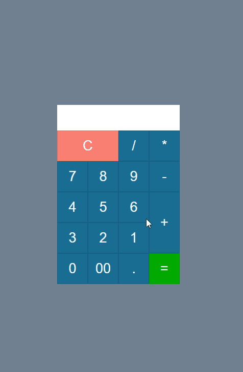
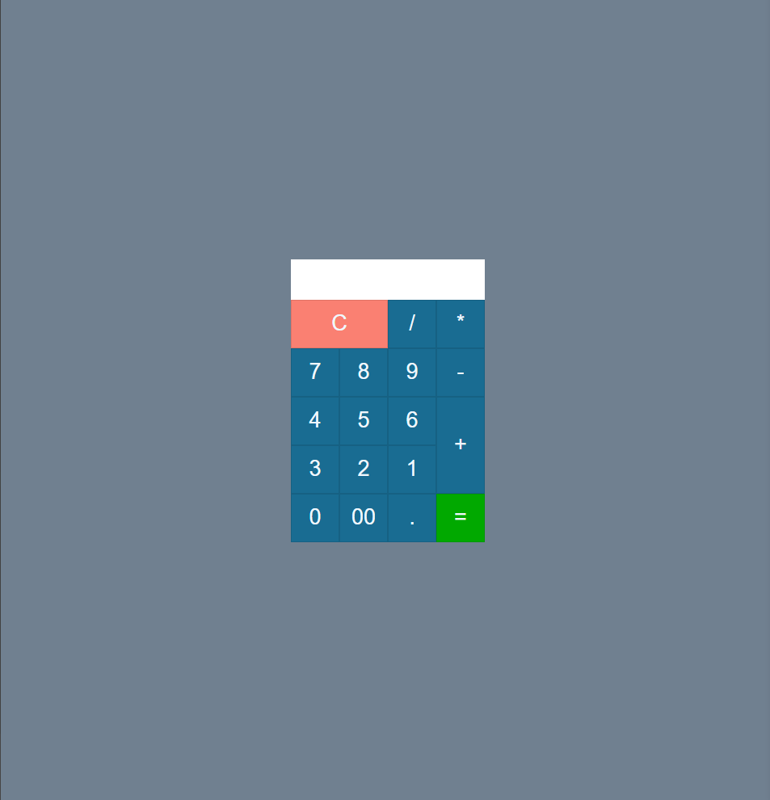
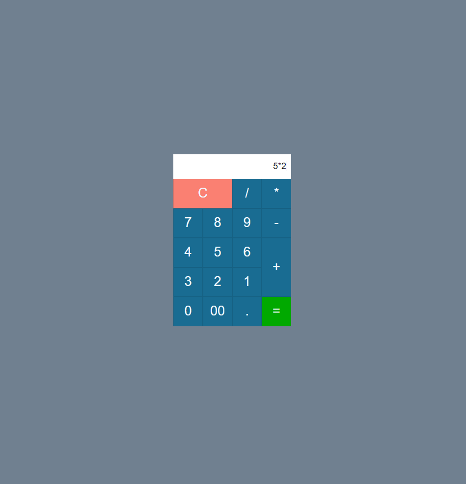

# calculadora
## calculadora com js,html,css 

<h3>sobre a aplicação</h3>

essa aplicação é uma calculadora simples, onde é possivel fazer calculos de adição, subtração, divisão e multiplicação. 
Pode ser utilizada pelo teclado ou pelo mouse.   

<h3>ideias para implementar</h3>

 <li>melhorar o design</li>
<li> aumentar funções- porcentagem, mod, etc</li>
<li> mais...</li>

<h3>bugs e problemas</h3>

<li> é possível colocar sinais iguais consecutivos, por exemplo (++++++)</li>

